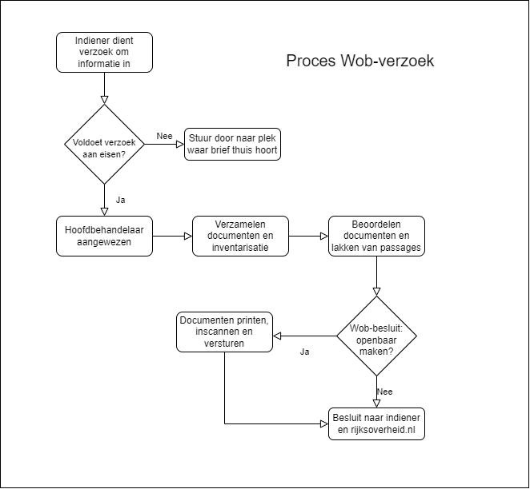

# Informatie Wob en informatieverzoeken

- Wat is de Wob?
- Wat is een Wob-verzoek?
- Hoe ziet het proces eruit?
- Wat zijn de regels?
- Welke documenten worden er geleverd?

## Wat is de Wob?
De Wob is een afkorting voor Wet openbaarheid van bestuur. Hierin wordt geregeld welke informatie de overheid openbaar moet maken en om welke redenen informatie niet openbaar kan worden. 

Relevant voor ons uit de [wet](https://wetten.overheid.nl/BWBR0005252/2018-07-28):

 > Artikel 3.1: Een ieder kan een verzoek om informatie neergelegd in documenten over een bestuurlijke aangelegenheid richten tot een bestuursorgaan of een onder verantwoordelijkheid van een bestuursorgaan werkzame instelling, dienst of bedrijf.

 > Artikel 3.3: De verzoeker behoeft bij zijn verzoek geen belang te stellen.

De Wob zal in mei 2022 worden vervangen door de Woo (Wet open overheid).

## Wat is een Wob-verzoek?

Op basis van artikel 3 van de Wob mag een ieder een verzoek om informatie doen bij een overheidsorganisatie. Dit kan worden gedaan per e-mail of via een formulier. Organisaties die in ieder geval onder de Wob vallen zijn de Rijksoverheid (een ministerie), gemeenten, provincies, waterschappen en publiekrechtelijke organisaties. 

Een Wob-verzoek moet aan de volgende voorwaarden voldoen:
- De organisatie moet onder de Wob vallen
- Er moet zo precies mogelijk aan worden gegeven waarover de verzoeker informatie wenst te ontvangen
- De informatie moet ergens zijn vastgelegd
- Het gaat om informatie die in het bezit is van de overheidsorganisatie
- Het gaat om informatie over het beleid van de organisatie, of over de voorbereiding of uitvoering van het beleid

## Hoe ziet het proces eruit?

1. De indiener dient het Wob-verzoek in. Dit kan via allerlei wegen binnenkomen
2. Er wordt getoetst of het Wob-verzoek aan de formele eisen voldoet, er wordt een hoofdbehandelaar aangewezen die het Wob-verzoek gaat behandelen
3. De hoofdbehandelaar gaat samen met het team documenten verzamelen, hierbij wordt er ook een inventarislijst opgesteld
4. De hoofdbehandelaar beoordeelt de document en lakt bepaalde passages weg in overleg met een jurist
5. De gelakte documenten worden geprint en vervolgens weer ingescant 
6. Het Wob-besluit inclusief de gelakte stukken worden naar de indiener gestuurd
7. Bij akkoord wordt het anoniem Wob-besluit gepubliceerd op www.rijksoverheid.nl

## Wat zijn de regels?

Volgens artikel 6.1 van de Wob heeft het bestuursorgaan uiterlijk vier weken de tijd om te beslissen op het verzoek om informatie. Artikel 6.2 stelt dat het bestuursorgaan de beslissing voor ten hoogste vier weken kan verdagen.

In artikel 10 staan uitzonderingsgronden en beperking bij het verstrekken van informatie, bijvoorbeeld wanneer het gaat om persoonsgegevens (10.1.d), het de veiligheid van de staat kan schaden (10.1.b) of het belang niet opweegt tegen andere belangen, zoals de eerbiediging van de persoonlijke levenssfeer (10.2.e) of de opsporing en vervolging van strafbare feiten (10.2.c).

## Welke documenten worden er geleverd?

Een Wob-verzoek bestaat vaak uit de volgende elementen:
- Het verzoek zelf, ingediend door de indiener
- Het besluit, waarin staat aangegeven welke documenten wel/niet zijn vrijgegeven. Hierin staat ook een toelichting
- Een inventarislijst met alle documenten en wat informatie hierover
- Eventuele bijlagen (vaak de vrijgegeven documenten)

