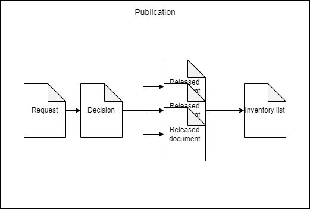
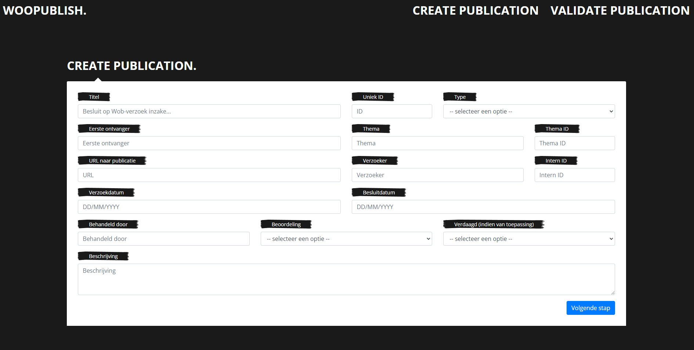
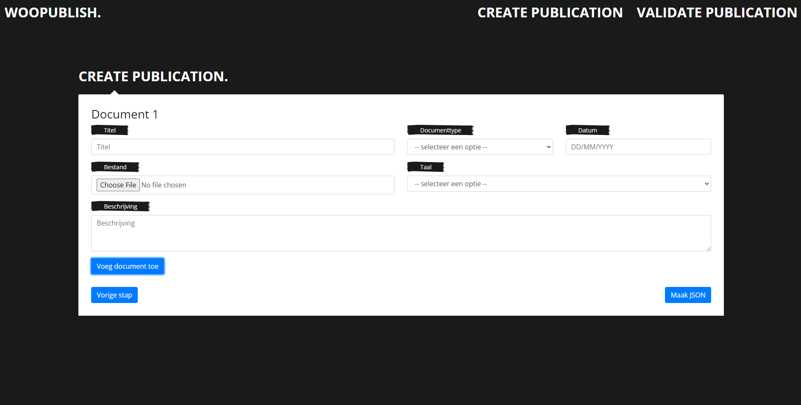
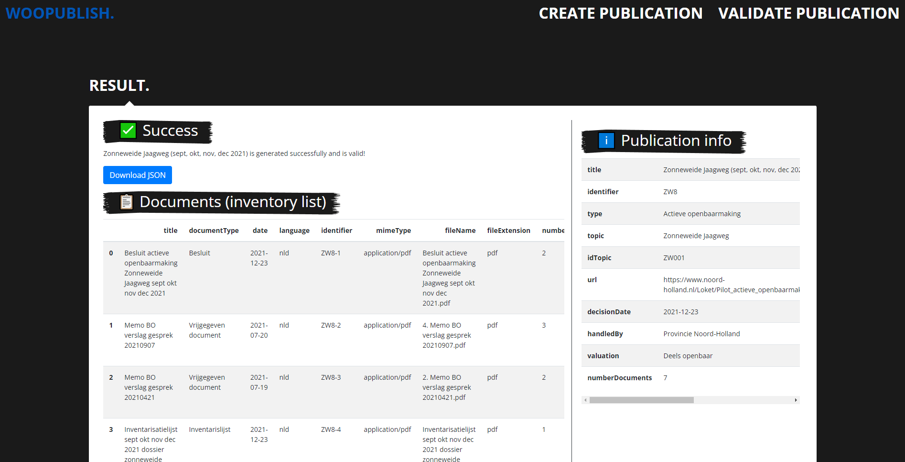
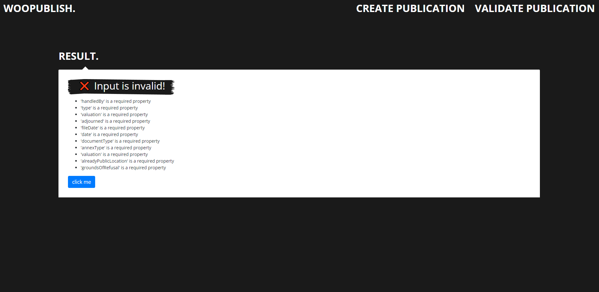

# Schema specificatie
Op basis van mijn onderzoek naar het FAIR en transparant publiceren van reacties op informatieverzoeken, hierbij het gemaakte schema. Het gaat uit van een publicatieobject, wat de gehele reactie betreft, en een documentobject, wat een enkel document in een publicatie representeert. Documenten kunnen van verschillende typen zijn.



## Attributen voor een publicatieobject
|     Attribute    |     Type    |     Verplicht?    |     Omschrijving    |     Voorbeeld    |
|---|---|---|---|---|
|     identifier    |     string/number    |     x    |     Uniek ID    |     3928    |
|     title    |     string    |     x    |     Titel Wob-verzoek    |     Besluit op Wob-verzoeken over   samenwerkingsovereenkomsten Nederlandse overheid en het World Economic Forum   (WOF)    |
|     type    |     string    |     x    |     2 keuzes: ‘Verzoek’ of ‘Actieve   openbaarmaking’    |     Verzoek    |
|     sourceUrl    |     string    |  |     URL naar publicatiepagina    |     https://www.rijksoverheid.nl/documenten/wob-verzoeken/2022/03/31/besluit-op-wob-verzoek-over-een-eu-rapport-over-gujarat-2002    |
|     topic    |     string    |  |     Eventueel thema van het   Wob-verzoek    |     Wob-verzoeken vrije tijd    |
|     idTopic    |     string    |  |     Uniek ID van het thema    |     VT01    |
|     handledBy    |     string    |     x    |     Verantwoordelijke voor het   behandelen van het Wob-verzoek    |     Ministerie van Buitenlandse Zaken    |
|     fileDate    |     date    |     x, bij type = ‘Verzoek’    |     Datum van indienen Wob-verzoek   (ISO 8601)    |     2021-12-04    |
|     decisionDate    |     date    |     x    |     Datum van reactie/besluit   Wob-verzoek (ISO 8601)    |     2022-02-02    |
|     valuation    |     string    |     x    |     Beoordeling geheel Wob-verzoek    |     Deels openbaar    |
|     isAdjourned    |     boolean    |     x, bij type = ‘Verzoek’    |     Geeft aan of het besluit verdaagd   is (ja/nee)    |     False    |
|     description    |     string    |  |     Beschrijving Wob-verzoek    |     Besluit op een verzoek om   informatie over de samenwerkingsovereenkomsten tussen de Nederlandse overheid   en het World Economic Forum (WEF).    |
|     documents    |     array    |  |     Lijst met alle documenten. Elk   document is een object.    |     -    |
|     idInternal    |     string/number    |  |     Volgnummer voor intern gebruik    |     BUZA-129    |
|     requester    |     string    |  |     Naam verzoeker    |     Follow the Money    |
|     numberDocuments    |     number    |  |     Aantal vrijgegeven documenten    |     5    |
|     retrievedAt    |     date    |  |     Downloaddatum van gebruiker (ISO   8601)    |     2022-12-05    |

## Attributen voor een documentobject
|     Attribute    |     Type    |     Verplicht?    |     Omschrijving    |     Voorbeeld    |
|---|---|---|---|---|
|     identifier    |     string/number    |     x    |     Uniek Document ID    |     BUZA19-3    |
|     title    |     string    |     x    |     Titel van het document    |     Besluit Wob verzoek De   Vaandeldrager    |
|     date    |     date    |     x    |     Datum gecreëerd (ISO 8601)    |     2021-01-19    |
|     description    |     string    |          |     Omschrijving     |     Besluitdocument behorende tot het   Wob verzoek De Vaandeldrager    |
|     fileName    |     string    |     x    |     Bestandsnaam    |     2021-105+Besluit+Wob-verzoek++De+Vaandeldrager.pdf    |
|     fileExtension    |     string    |     x    |     Type bestand (pdf, zip, etc)    |     PDF    |
|     mimeType    |     string    |     x    |     MIME type van het bestand    |     application/pdf    |
|     documentType    |     string    |     x    |     Type document (keuze uit: bijlage,   besluit, inventaris, verzoek)    |     Besluit    |
|     rights    |     string    |          |     Rechten van het document    |     CC BY    |
|     sourceUrl    |     string    |  |     URL naar bestand    |     https://www.rijksoverheid.nl/documenten/wob-verzoeken/2022/02/25/besluit-wob-verzoek-schilderij-de-vaandeldager-over-adviezen-aankoop    |
|     numberPages    |     number    |  |     Aantal pagina's bestand    |     3    |
|     numberWords    |     number    |  |     Aantal woorden in bestand    |     291    |
|     numberCharacters    |     number    |          |     Aantal karakters in bestand    |     1382    |
|     isScan    |     boolean    |  |     Is het document ingescand (en dus   niet leesbaar voor een computer)?    |     False    |
|     numberTextPages    |     number    |  |     Aantal pagina's in bestand met tekst    |     2    |
|     bodyText    |     string    |          |     Tekst in het document    |     Lorem ipsum…..    |
|     language    |     string    |  |     Taal van het document (ISO-639-3 standaard)    |     nld    |
|     fileSize    |     string    |  |     Grootte van het bestand    |     392 kB    |
|     annexType    |     string    |     x, bij documentType = ‘Vrijgegeven document’     |     Type vrijgegeven document    |     Email    |
|     valuation    |     string    |     x, bij documentType = ‘Vrijgegeven   document’     |     Beoordeling individueel document    |     Deels openbaar    |
|     groundsOfRefusal    |     list    |     x, bij valuation = ‘Deels openbaar’ of ‘Niet   openbaar’     |     Weigeringsgronden    |     10.2.e,10.2.f    |
|     alreadyPublicLocation    |     string    |     x, bij valuation = ‘Reeds openbaar’       |     Vindplaats van reeds openbaar   document (URL)    |     https://www.rijksoverheid.nl/documenten/wob-verzoeken/2022/02/25/besluit-wob-verzoek-schilderij-de-vaandeldager-over-adviezen-aankoop    |
|     originator    |     string    |          |     Afzender    |     Minister VWS    |
|     recipient    |     string    |          |     Ontvanger    |     Sywert van Lienden    |

## JSON validatie
De attributen kunnen het beste worden opgeslagen in een JSON bestand. Dat kan vervolgens gevalideerd worden door JSON schema om na te gaan of alle verplichte velden aanwezig zijn en van het juiste formaat zijn. Het schema is [hier](../software/validation/validationSchema.json) te bekijken. Door middel van een Python module 'jsonschema' kan een gemaakt JSON bestand worden vergeleken met het JSON schema. 

### Tool
Ik heb zelf een tool ontwikkeld om JSON bestanden te genereren en valideren. Dit ziet er ongeveer zo uit:

Invoeren attributen voor publicatieobject


Invoeren attributen voor documentobject


Validatie en maken geslaagd - resultaatpagina


Validatie en maken niet geslaagd - foutmeldingen


Als jullie interesse hebben hierin dan kan ik jullie de code sturen!

## Voorbeeld JSON
Hieronder een zelfgemaakt voorbeeld van een publicatie met documentobjecten. Het is afkomstig van [hier](https://www.noord-holland.nl/Loket/Pilot_actieve_openbaarmaking/Documenten/Zonneweide_Jaagweg_sept_okt_nov_dec_2021). Dit betreft een actieve openbaarmaking.

``` 
{
    "title": "Zonneweide Jaagweg (sept, okt, nov, dec 2021)",
    "identifier": "ZW8",
    "type": "Actieve openbaarmaking",
    "topic": "Zonneweide Jaagweg",
    "idTopic": "ZW001",
    "url": "https://www.noord-holland.nl/Loket/Pilot_actieve_openbaarmaking/Documenten/Zonneweide_Jaagweg_sept_okt_nov_dec_2021",
    "decisionDate": "2021-12-23",
    "handledBy": "Provincie Noord-Holland",
    "valuation": "Deels openbaar",
    "documents": [
      {
        "title": "Besluit actieve openbaarmaking Zonneweide Jaagweg sept okt nov dec 2021",
        "documentType": "Besluit",
        "date": "2021-12-23",
        "language": "nld",
        "identifier": "ZW8-1",
        "mimeType": "application/pdf",
        "fileName": "Besluit actieve openbaarmaking Zonneweide Jaagweg sept okt nov dec 2021.pdf",
        "fileExtension": "pdf",
        "numberPages": 2,
        "numberCharacters": 4069,
        "numberWords": 548,
        "numberTextPages": 2
      },
      {
        "title": "Memo BO verslag gesprek 20210907",
        "documentType": "Vrijgegeven document",
        "date": "2021-07-20",
        "language": "nld",
        "recipient": "Gedeputeerde Stigter, wethouder Van Dolder",
        "annexType": "Memo",
        "valuation": "Deels openbaar",
        "groundsOfRefusal": [
          "10.2.e"
        ],
        "identifier": "ZW8-2",
        "mimeType": "application/pdf",
        "fileName": "4. Memo BO verslag gesprek 20210907.pdf",
        "fileExtension": "pdf",
        "numberPages": 3,
        "numberCharacters": 4953,
        "numberWords": 766,
        "numberTextPages": 3
      },
      {
        "title": "Memo BO verslag gesprek 20210421",
        "documentType": "Vrijgegeven document",
        "date": "2021-07-19",
        "language": "nld",
        "recipient": "Gedeputeerde Stigter, wethouder Van Dolder",
        "annexType": "Memo",
        "valuation": "Deels openbaar",
        "groundsOfRefusal": [
          "10.2.e"
        ],
        "identifier": "ZW8-3",
        "mimeType": "application/pdf",
        "fileName": "2. Memo BO verslag gesprek 20210421.pdf",
        "fileExtension": "pdf",
        "numberPages": 2,
        "numberCharacters": 3522,
        "numberWords": 511,
        "numberTextPages": 2
      },
      {
        "title": "Inventarisatielijst sept okt nov dec 2021 dossier zonneweide Jaagweg",
        "documentType": "Inventarislijst",
        "date": "2021-12-23",
        "language": "nld",
        "identifier": "ZW8-4",
        "mimeType": "application/pdf",
        "fileName": "Inventarisatielijst sept okt nov dec 2021 dossier zonneweide Jaagweg.pdf",
        "fileExtension": "pdf",
        "numberPages": 1,
        "numberCharacters": 534,
        "numberWords": 98,
        "numberTextPages": 1
      },
      {
        "title": "Memo BO verslag gesprek 20210324",
        "documentType": "Vrijgegeven document",
        "date": "2021-07-19",
        "language": "nld",
        "recipient": "Gedeputeerde Stigter, wethouder van Dolder",
        "annexType": "Memo",
        "valuation": "Deels openbaar",
        "groundsOfRefusal": [
          "10.2.e"
        ],
        "identifier": "ZW8-5",
        "mimeType": "application/pdf",
        "fileName": "1. Memo BO verslag gesprek 20210324.pdf",
        "fileExtension": "pdf",
        "numberPages": 2,
        "numberCharacters": 2966,
        "numberWords": 417,
        "numberTextPages": 2
      },
      {
        "title": "Agenda BO 18112021 gedeputeerde Stigter en Koggenland zonneweide Jaagweg",
        "documentType": "Vrijgegeven document",
        "date": "2021-11-17",
        "language": "nld",
        "recipient": "Gedeputeerde Stigter, portefeuille klimaat en energie",
        "annexType": "Agenda",
        "valuation": "Deels openbaar",
        "groundsOfRefusal": [
          "10.2.e"
        ],
        "identifier": "ZW8-6",
        "mimeType": "application/pdf",
        "fileName": "5. Agenda BO 18112021 gedeputeerde Stigter en Koggenland zonneweide Jaagweg.pdf",
        "fileExtension": "pdf",
        "numberPages": 2,
        "numberCharacters": 1637,
        "numberWords": 211,
        "numberTextPages": 2
      },
      {
        "title": "Memo BO verslag gesprek 20210520",
        "documentType": "Vrijgegeven document",
        "date": "2021-07-19",
        "language": "nld",
        "recipient": "Gedeputeerde Stigter, wethouder Van Dolder",
        "annexType": "Memo",
        "valuation": "Deels openbaar",
        "groundsOfRefusal": [
          "10.2.e"
        ],
        "identifier": "ZW8-7",
        "mimeType": "application/pdf",
        "fileName": "3. Memo BO verslag gesprek 20210520.pdf",
        "fileExtension": "pdf",
        "numberPages": 2,
        "numberCharacters": 3031,
        "numberWords": 449,
        "numberTextPages": 2
      }
    ],
    "numberDocuments": 7
}
```